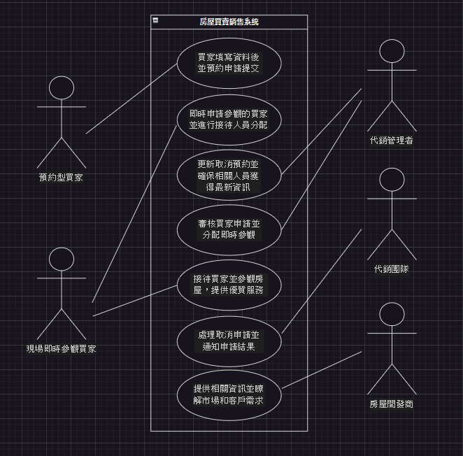
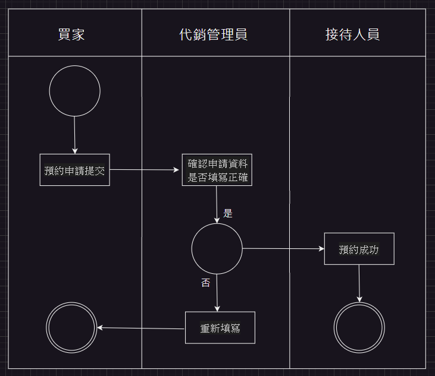
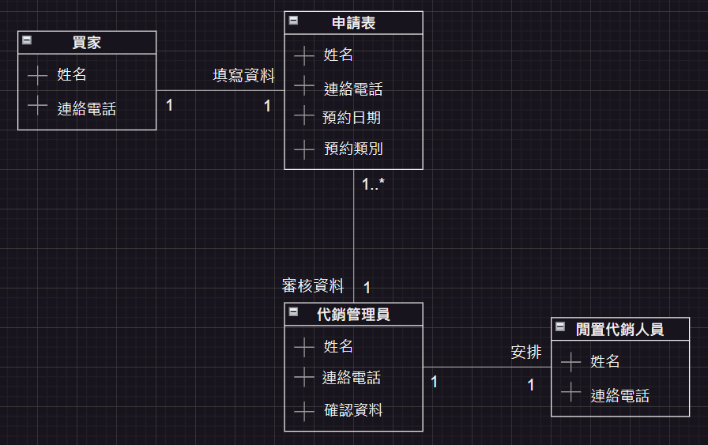
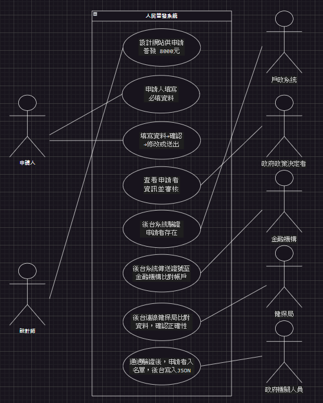
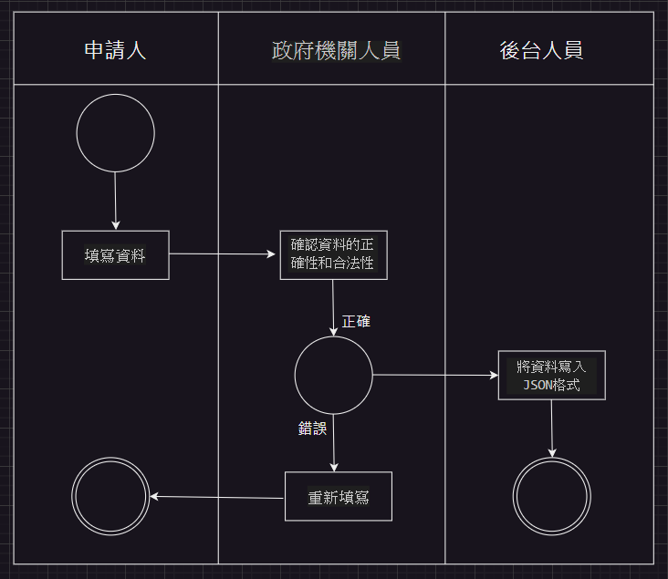
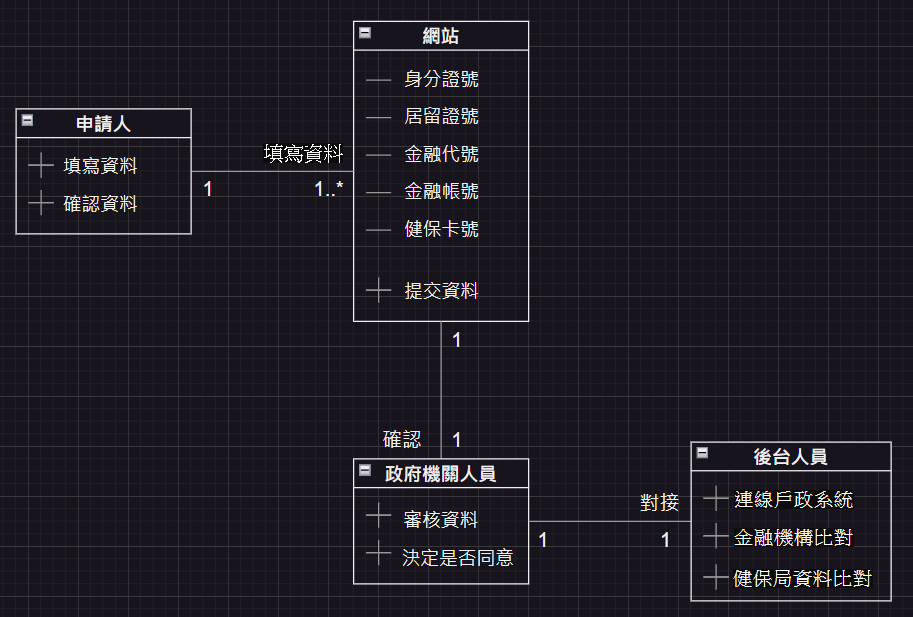

# 期中考-期中-Mid 
<!--(期中標籤註記，該行不能刪，作為驗證標籤，該檔案若沒該份標籤，代表直接貼上saample，直接0分)-->

>
>學號：111111203
> 
>姓名：張紋綺
> 

本份文件包含以下主題：(至少需下面兩項，若是有多者可以自行新增)
- [x] 答題

## 答題
>1. 

(a) 
利害人關係表
|  利害人   | 目標  |
|  ----  | ----  |
| 前台：  |  |
| 預約型買家  | 1.順利預約看房。 2.提供優質服務和專業指導。 3.接收預約結果的通知消息。 4.獲得所需的房屋資訊。 |
| 現場即時參觀買家  |  1.即時參觀房屋的情況。 2.即時參觀房屋並做出購買決定。 3.順利提交參觀申請。 4.即時接收預約結果通知消息。 |
| 後台：  |  |
| 代銷管理者  | 1.有效管理預約並安排接待人員。 2.分析參觀申請數據並改進服務流程和提升效率。 3.提供指導並應對任何突發狀況或客戶需求。 4.確保與代銷團隊的合作並提供一致的客戶體驗。 |
| 代銷團隊  | 1.確保客戶的預約和參觀申請並迅速且準確處理。 2.提供優質服務並滿足客戶期望。 3.確保團隊間溝通，保障服務順暢。 4.持續改進並應對市場和客戶需求。 |
| 房屋開發商  | 1.提高銷售競爭力。 2.提供符合客戶需求的房屋和服務。 3.建立良好的品牌形象和口碑。 4.遵守法律法規，確保業務合規運作。 |

事件表： 
|  事件名稱   | 使用案例  |
|  ----  | ----  |
| 前台：  |  |
| 預約型買家申請流程  | 買家填寫資料後並提交申請。 |
| 現場即時參觀買家申請流程  | 即時申請參觀的買家並進行接待人員分配。 |
| 預約型買家取消申請流程  | 更新取消預約並確保相關人員獲得最新資訊。 |
| 後台：  |  |
| 代銷管理者審核申請  | 審核買家申請並分配即時參觀。 |
| 買家接待與看房流程  | 接待買家並參觀房屋，提供優質服務。 |
| 代銷管理者處理取消申請  | 處理取消申請並通知申請結果。 |
| 提供資訊給開發商 | 提供相關資訊並瞭解市場和客戶需求。 |

(b) 

(c) 
|  使用案例名稱： | 預約型買家申請  |
|  ----  | ----  |
| 使用案例描述：  | 買家填寫資料後，提交預約申請。 |
| 主要參與者：  | 預約型買家、代銷管理者 |
| 利害關係人與目標：  |  預約型買家：成功預約看房並接受優質服務。 代銷管理者：有效管理預約並確保能夠順利。 |
| 前置條件：  | 預約型買家需要填寫資料。 |
| 後置條件：  | 申請成功提交後進入後台審核流程。 |
| 主要成功情節：  | 預約型買家填寫完後送出申請並提交到後台。 |
| 例外情節與其他需求：  | 預約型買家未填寫所有必填欄位，系統應提示所有必填欄位才能繼續。 |

|  使用案例名稱：   | 後台審核申請  |
|  ----  | ----  |
| 使用案例描述：  | 代銷管理者審核申請並檢查資訊的完整性與正確性。 |
| 主要參與者：  | 代銷管理者 |
| 利害關係人與目標：  | 確保申請的合理性並進行時程安排。 |
| 前置條件：  | 代銷管理者進入後台系統，查看待審核的申請。 |
| 後置條件：  | 申請審核完成後，根據結果進行安排。 |
| 主要成功情節：  | 代銷管理者審核申請通過並安排時程。 |
| 例外情節與其他需求：  | 如果申請資料不完整，代銷管理者能夠退回申請並通知買家重新填寫。 |

|  使用案例名稱：   | 安排接待人員  |
|  ----  | ----  |
| 使用案例描述：  | 根據預約型買家的申請及現場即時參觀買家的需求，代銷管理者安排適當的代銷進行接待。 |
| 主要參與者：  | 代銷管理者 |
| 利害關係人與目標：  | 確保接待人員的管理並提供優質服務。 |
| 前置條件：  | 審核通過的申請，會有閒置的代銷人員。 |
| 後置條件：  | 代銷人員安排完後，通知買家及代銷人員。 |
| 主要成功情節：  |  代銷管理者根據申請情況安排適當的代銷進行接待。 |
| 例外情節與其他需求：  | 如果沒有足夠的代銷人員可以安排，系統應提示代銷管理者進行調整。 |

|  使用案例名稱：   | 通知預約結果  |
|  ----  | ----  |
| 使用案例描述：  | 將預約結果通知給預約型買家，包括預約成功或失敗的訊息。 |
| 主要參與者：  | 代銷管理者、預約型買家 |
| 利害關係人與目標：  | 代銷管理者：確保買家獲得準確的預約結果訊息。 預約型買家：得知預約結果並進行下一步安排。 |
| 前置條件：  | 預約型買家已成功提交申請並等待結果通知。 |
| 後置條件：  |  買家收到通知後，可以根據結果進行相應的行動。 |
| 主要成功情節：  | 代銷管理者成功審核並安排接待人員。 |
| 例外情節與其他需求：  | 如果通知無法發送，系統應有另外通知方式，如電子郵件或簡訊。 |

活動圖： 

(d) 

>2. 

(a) 
利害人關係表
|  利害人   | 目標  |
|  ----  | ----  |
| 前台：  |  |
| 申請人  | 1.領取 8000 元。 2.提供正確資訊申請。 3.提供簡易申請流程。 4.確保個人資訊安全維護。 |
| 設計師  | 1.滿足政府需求，完成網站架構。 2.提供使用者良好的使用體驗。 3.確保網站的安全性和穩定性。 4.優化網站性能及提高效率。 |
| 後台：  |  |
| 政府政策決定者  | 1.確保公平性與透明度。 2.提高效率和便利性。 3.保障資料安全和隱私。 4.有效達成政策目標。 |
| 政府機關人員  | 1.審核申請資料並核准發放。 2.監督系統運作，管理後台操作。 3.保障申請人權益，提供優良服務。 4.配合政府政策，推動普發政策實施。 |
| 戶政系統  | 1.提供準確的身份資訊核對服務。 2.保障個人隱私資訊安全。 3.提高身份核對效率。 4.配合政府政策實施並確保合規性。 |
| 金融機構  | 1.提供準確的金融資訊比對服務。 2.保護客戶資訊安全。 3.提高金融服務效率。 4.配合政府政策並確保合規性。 |
| 健保局  | 1.提供準確的健保資訊。 2.保護被保人資訊安全。 3.提高健保資訊查驗效率。 4.配合政府並確保政策一致性。 |

事件表： 
|  事件名稱   | 使用案例  |
|  ----  | ----  |
| 前台：  |  |
| 設計網站  | 設計網站提供申請普發 8000元。 |
| 資料登記  | 申請人填寫必填資料。 |
| 確認資訊  | 填寫資料→確認→修改或送出。 |
| 後台：  |  |
| 審核資料  | 查看申請者資訊並審核。 |
| 戶政系統連線驗證  | 後台系統驗證申請者是否存在。 |
| 金融機構比對資訊  | 後台系統傳送證號到金融機構比對帳戶。 |
| 健保局資料比對  |  後台連線健保局比對資料並確認正確性。 |
| 合格資料寫入JSON | 通過驗證後，申請者寫入名單，後台寫入JSON。 |

(b) 

(c)
|  使用案例名稱： | 申請人填寫資料  |
|  ----  | ----  |
| 使用案例描述：  | 申請人進入申請網頁，填寫身分證字號/居留證號、金融代號、金融機構帳號、健保卡號等資料。 |
| 主要參與者：  | 申請人 |
| 利害關係人與目標：  |  提供正確個人資料以進行申請。 |
| 前置條件：  |  申請人已申請相關資訊並確認資格，進入申請網頁。 |
| 後置條件：  | 資料填寫完畢，進入下一步驟。 |
| 主要成功情節：  | 申請人填寫所有必要資料且無錯誤並完成資料填寫。 |
| 例外情節與其他需求：  | 申請人未填寫必要資料，系統將提示必填所有必填欄位才能繼續。 |

|  使用案例名稱： | 確認資訊  |
|  ----  | ----  |
| 使用案例描述：  | 申請人填寫資料後進入確認頁面，檢查資料是否正確，需要修改則返回填入畫面，若正確可以直接送出。 |
| 主要參與者：  | 申請人 |
| 利害關係人與目標：  |  確認資料正確無誤。 |
| 前置條件：  |  申請人填寫完資料後送出。 |
| 後置條件：  | 若資料確認正確，則進入下一步驟。 |
| 主要成功情節：  |  申請人確認資訊正確。 |
| 例外情節與其他需求：  | 如果申請人在確認資訊時發現錯誤，系統應提供返回修改的選項，以便修正資料。 |

|  使用案例名稱： | 後台資料驗證  |
|  ----  | ----  |
| 使用案例描述：  | 後台系統與政府的第三方戶政系統、金融機構和健保局進行連線，驗證申請者提供資料的正確性和合法性。 |
| 主要參與者：  | 政府機關人員 |
| 利害關係人與目標：  |  確保資料的正確性。 |
| 前置條件：  |   政府機關人員進入後台系統，能夠訪問到戶政系統、金融機構和健保局。 |
| 後置條件：  |  若資料驗證通過，則進行下一步驟。 |
| 主要成功情節：  |  資料驗證通過，申請者進入普發名單。 |
| 例外情節與其他需求：  | 如果戶政系統、金融機構或健保局的資料驗證未通過，系統應提示後台人員相應的訊息，以便進行後續處理。 |

|  使用案例名稱： | 寫入JSON格式  |
|  ----  | ----  |
| 使用案例描述：  | 若戶政系統、金融機構和健保局的資料驗證皆通過，後台人員將合格資料寫入JSON格式以便之後使用。 |
| 主要參與者：  | 政府機關人員 |
| 利害關係人與目標：  |  將合格資料寫入JSON格式。 |
| 前置條件：  |   資料驗證通過並確認資訊正確。 |
| 後置條件：  |  資料成功寫入JSON格式，完成之後使用。 |
| 主要成功情節：  |  資料成功寫入JSON格式。 |
| 例外情節與其他需求：  | 如果資料寫入JSON格式過程中出現錯誤，系統應妥善處理並提供錯誤以便後續排查。 |

活動圖： 

(d) 

